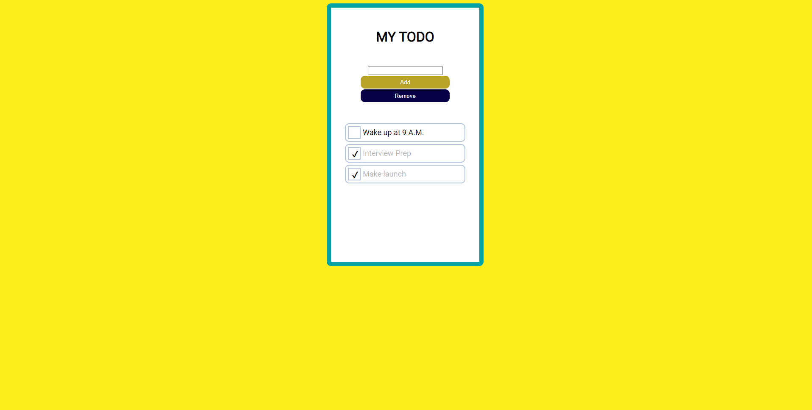

  

# MyToDo

An HTML, CSS and JS based todolist where you can add your tasks and delete done tasks

---

 

## Motivation

Create this website to apply basic concepts of JavaScript and help others to start their journey in Web Development.

## Screenshots

## Tech/ Framework Used

**Built with**

1. [HTML5](https://developer.mozilla.org/en-US/docs/Web/HTML)
1. [CSS3](https://developer.mozilla.org/en-US/docs/Web/CSS)
1. [JavaScript](https://developer.mozilla.org/en-US/docs/Web/javascript)

## How to use?

If you want to use the website just go to this [link](https://debajit13.github.io/MyToDo/)

- If you want to add todo just write your todo in the input field and press the Add button.
- If you want mark any task as done just click on the todo and it marks it as done.
- If you want to delete all the done todo just click on the Remove button.

## Want To Be a Contributor?

Read [CONTRIBUTING.md](./CONTRIBUTING.md) for contribution guidelines.

Made with :heart: and :coffee: by Debajit Mallick

